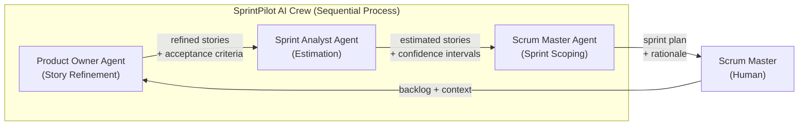
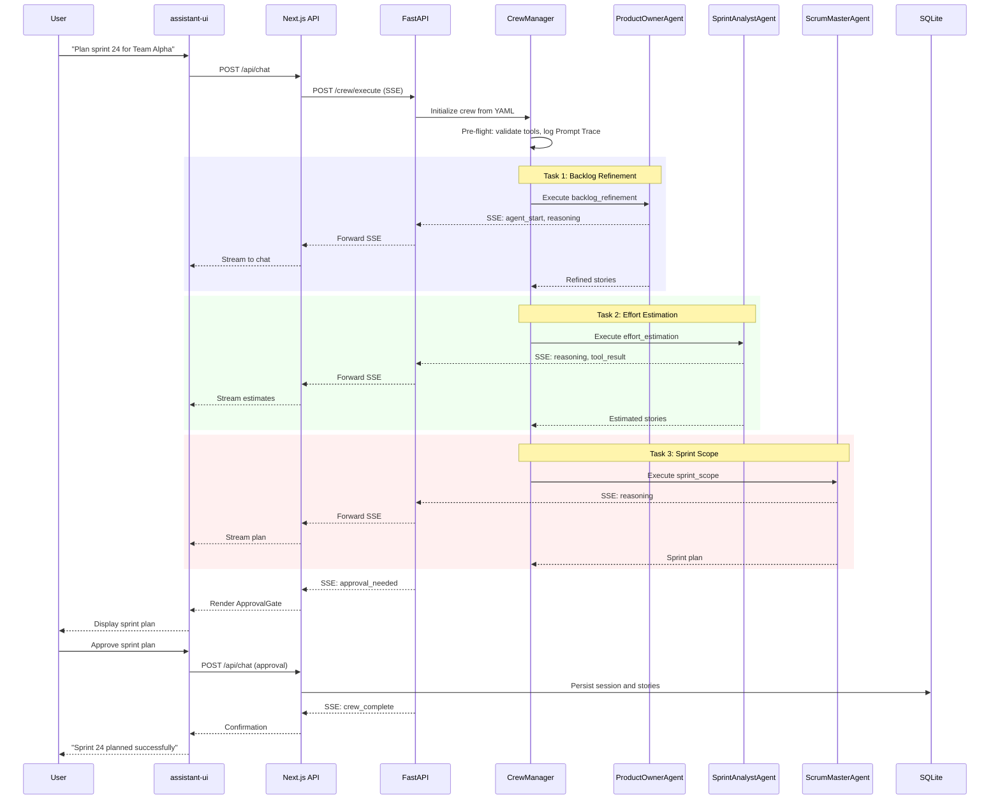

# MVP System Architecture Document: SprintPilot AI

**Product Name**: SprintPilot AI
**Architecture Focus**: Lean MVP -- AI-native multi-agent sprint planning with CrewAI, Next.js + assistant-ui frontend
**Document Status**: MVP Draft v1.0
**Adapter**: CrewAI (AAMAD_ADAPTER=crewai)
**Scope**: P0 features only (F1--F4); all non-essential components and NFRs deferred to Future Work

---

## 1. MVP Architecture Philosophy & Principles

### MVP Design Principles

**Human-in-the-Loop by Default**: Every critical decision point -- sprint scope commitment, estimation override, story approval -- requires explicit human confirmation. AI agents handle mechanical overhead (story creation, dependency mapping, velocity forecasting) while humans retain strategic authority. This follows the cognitive amplification model validated in production agile teams (PRD Section 6; MRD Section 3 -- over 60% of teams cite trust and control as primary AI adoption constraints).

**Transparency and Explainability**: Every agent recommendation includes the reasoning chain, data sources considered, confidence levels, and an override option. Agent execution streams in real time to the UI so users observe reasoning as it happens, reducing perceived latency and building trust (PRD Section 6).

**Reproducibility First**: Agent memory is disabled (memory=false) for MVP to ensure deterministic, auditable artifact creation. Every crew execution produces the same output given the same inputs, enabling reliable testing and governance (adapter-crewai rules).

**Minimal Viable Architecture**: Implement the simplest deployment, data layer, and component topology that proves the core value proposition. Prefer local-first tooling (SQLite, direct process launch) over distributed infrastructure. Scale concerns are explicitly deferred.

### Core vs. Future Features

| Phase | Scope | Rationale |
| :---- | :---- | :-------- |
| **MVP (This Document)** | Core multi-agent sprint planning (F1--F4), chat-based UI, FastAPI backend, SQLite storage, local execution | Prove core value: AI reduces sprint planning overhead by 30--40% with human-in-the-loop trust model |
| **Phase 2 -- Enhanced** | Full Jira sync (F7), predictive velocity (F5), cross-sprint patterns (F6), PostgreSQL, Redis, production observability | Strengthen differentiation and enterprise readiness based on beta feedback |
| **Phase 3 -- Scale** | GitHub/Slack/Teams integrations, SSO, VPC deployment, multi-team planning (F8--F11), Kubernetes, LangGraph evaluation | Enterprise features and horizontal scaling |

**MVP Scope Boundaries** (PRD Section 4, Priority P0):

- End-to-end sprint planning workflow: backlog intake via chat, story refinement, AI estimation, sprint scope recommendation, human approval.
- Single-user local execution; no multi-tenant user management.
- SQLite for all persistent data.
- No external integrations (Jira scaffolding deferred to Phase 2).
- Environment-variable-based secret management for LLM API keys.

### Technical Architecture Decisions

**Decision 1: Next.js App Router as Client-Side SPA with Co-located API Routes**

App Router is used as a client-side single-page application framework with co-located API route handlers. All HTML and CSS are generated in the browser; the server produces no rendered markup. App Router's `/api` route convention provides a convenient SSE proxy to FastAPI without requiring a separate Node server. React Server Components are not used for MVP -- the entire UI is interactive (chat-based) with no SEO or server-rendering benefit for a local-only, single-user tool (PRD Section 5; PRD Section 6).

**Decision 2: assistant-ui over Custom Chat Interface**

assistant-ui provides a production-grade LLM chat interface with built-in streaming message handling, tool result rendering via custom components, and conversation thread management. Building a custom chat interface would require 4--6 weeks for equivalent functionality. assistant-ui's component model allows custom tool components for agent-specific result displays (PRD Section 6).

**Decision 3: CrewAI Sequential Process over Hierarchical**

Sequential execution is chosen because sprint planning follows a natural linear workflow: backlog analysis -> estimation -> sprint scoping. Sequential process provides deterministic execution order, simpler debugging, and predictable token consumption. The adapter pattern supports future migration to hierarchical process if needed (PRD Section 3; MRD Section 2).

**Decision 4: Python/FastAPI Backend Separate from Next.js**

CrewAI is a Python framework; a dedicated FastAPI service provides async support for long-running crew executions, proper Python dependency management, and clean separation of concerns. The Next.js API layer acts as a thin SSE proxy (PRD Section 3).

**Decision 5: SSE (Server-Sent Events) for Streaming**

SSE is chosen over WebSockets because the communication pattern is unidirectional (server -> client) during crew execution. SSE works natively with HTTP/2, requires no special proxy configuration, and integrates cleanly with assistant-ui's streaming message model (PRD Section 6).

---

## 2. Multi-Agent System Specification

### Agent Architecture

SprintPilot AI uses three specialized agents for MVP, mapping to real agile team roles. This provides a natural, explainable mental model for users (MRD Section 5; PRD Section 1).



**Agent 1: Product Owner Agent**

| Attribute | Value |
| :-------- | :---- |
| role | "AI Product Owner for Backlog Grooming and Story Refinement" |
| goal | "Analyze and refine product backlog by breaking down epics into well-formed user stories with clear acceptance criteria, business value scoring, and dependency mapping" |
| backstory | "An experienced product owner who excels at translating business objectives into actionable engineering work. Applies structured decomposition and prioritization frameworks, always grounding decisions in user research and business metrics." |
| tools | [backlog_reader, story_generator, acceptance_criteria_validator, dependency_mapper] |
| llm | OpenAI GPT-4-class |
| memory | false |
| allow_delegation | false |
| verbose | false (production), true (development) |
| max_iter | 12 |
| max_execution_time | 300 seconds |
| max_retry_limit | 2 |
| respect_context_window | true |

*PRD Traceability*: PRD Section 3 -- Agent 2; PRD Section 4 -- F2 (Automated Backlog Grooming).

**Agent 2: Sprint Analyst Agent**

| Attribute | Value |
| :-------- | :---- |
| role | "AI Sprint Analyst for Estimation and Velocity Forecasting" |
| goal | "Provide data-driven sprint estimation with historical confidence intervals, predict sprint outcomes based on team velocity patterns, and detect cross-sprint anti-patterns for continuous improvement" |
| backstory | "A quantitative analyst specializing in agile metrics and software delivery performance. Combines statistical rigor with practical engineering intuition, always presenting estimates as ranges with explicit confidence levels rather than false precision." |
| tools | [estimation_engine, velocity_forecaster, metrics_dashboard] |
| llm | OpenAI GPT-4-class |
| memory | false |
| allow_delegation | false |
| verbose | false (production), true (development) |
| max_iter | 12 |
| max_execution_time | 300 seconds |
| max_retry_limit | 2 |
| respect_context_window | true |

*PRD Traceability*: PRD Section 3 -- Agent 3; PRD Section 4 -- F3 (AI-Assisted Estimation).

**Agent 3: Scrum Master Agent**

| Attribute | Value |
| :-------- | :---- |
| role | "AI Scrum Master for Sprint Planning Facilitation" |
| goal | "Facilitate sprint planning by coordinating agent activities, enforcing agile best practices, identifying impediments, and ensuring sprint scope aligns with team capacity and velocity history" |
| backstory | "A seasoned scrum practitioner with deep experience facilitating sprint planning for distributed engineering teams. Prioritizes team sustainability, predictable delivery, and data-driven decision-making over heroic commitments." |
| tools | [velocity_calculator, capacity_analyzer, sprint_history_reader] |
| llm | OpenAI GPT-4-class |
| memory | false |
| allow_delegation | false |
| verbose | false (production), true (development) |
| max_iter | 12 |
| max_execution_time | 300 seconds |
| max_retry_limit | 2 |
| respect_context_window | true |

*PRD Traceability*: PRD Section 3 -- Agent 1; PRD Section 4 -- F4 (Sprint Scope Recommendation).

### Task Orchestration

Tasks execute sequentially, matching the natural sprint planning workflow (PRD Section 2).

**Task 1: Backlog Analysis and Story Refinement**

| Attribute | Value |
| :-------- | :---- |
| id | backlog_refinement |
| description | Analyze imported backlog items, break down epics into well-formed user stories conforming to INVEST principles, generate acceptance criteria, score business value, and map dependencies. |
| agent | Product Owner Agent |
| expected_output | JSON array of refined stories: title, description, acceptance_criteria (array), business_value_score (1-10), dependencies (array of story IDs), original_epic_id. Passed to next task via context. |
| context | User-provided backlog items (epics, raw stories) from the chat session. |
| human_input | false (output reviewed at sprint scope stage) |

**Task 2: Effort Estimation with Confidence Intervals**

| Attribute | Value |
| :-------- | :---- |
| id | effort_estimation |
| description | Estimate effort for each refined story using historical velocity data and similar story analysis. Provide point estimates with confidence ranges and reference comparable historical stories. |
| agent | Sprint Analyst Agent |
| expected_output | JSON array extending Task 1 output with: story_points (integer), confidence_range (low, high, confidence_pct), comparable_stories (array), estimation_rationale (string). |
| context | [backlog_refinement] -- receives refined stories from Task 1. |
| human_input | false (estimates reviewed at sprint scope stage) |

**Task 3: Sprint Scope Recommendation**

| Attribute | Value |
| :-------- | :---- |
| id | sprint_scope |
| description | Generate optimal sprint scope recommendation based on estimated stories, team capacity, historical velocity, and dependencies. Produce a complete sprint plan with rationale for inclusion/exclusion of each story. |
| agent | Scrum Master Agent |
| expected_output | Sprint plan: recommended_stories (prioritized array), total_story_points, team_capacity_assessment, velocity_comparison, risk_factors, excluded_stories_with_rationale, overall_confidence_level. Streamed to user for review. |
| context | [backlog_refinement, effort_estimation] -- receives full story data from Tasks 1 and 2. |
| human_input | true (sprint plan requires explicit human approval per PRD Section 4 -- F4) |

**Error Handling and Retry Policy**:

- On agent task failure: retry with exponential backoff up to max_retry_limit (2 retries).
- On persistent failure: degrade gracefully to partial output with "Incomplete -- [reason]" marker.
- On context window overflow: halt the task, write a Diagnostic with token usage data, and surface to the user.

### CrewAI Framework Configuration

All agent and task definitions are externalized to YAML configuration files under `config/` (per adapter-crewai rules). The main orchestration module (`crew.py`) loads these YAML configs at runtime.

| Configuration | Value | Rationale |
| :------------ | :---- | :-------- |
| Process type | Sequential | Deterministic execution for linear sprint planning workflow |
| Memory | false | Reproducibility for MVP; enables deterministic testing |
| Verbose | false (production), true (development) | Minimize token usage in production |
| Max RPM (crew-level) | 60 | Rate limit to control LLM API budget |
| Execution mode | ReAct (default) | No function_calling_llm specified; agents use ReAct reasoning |
| YAML config paths | config/agents.yaml, config/tasks.yaml | Externalized per adapter-crewai rules |

**Prompt Transparency**: Before each crew execution, the system logs the full system+user prompts to a Prompt Trace file under `project-context/2.build/logs/`. If CrewAI-injected instructions conflict with expected output templates, the crew aborts with a Diagnostic.

---

## 3. Frontend Architecture Specification (Next.js + assistant-ui)

### Technology Stack

| Technology | Version/Variant | Purpose |
| :--------- | :-------------- | :------ |
| Next.js | 14+ with App Router | Framework: client-side SPA with co-located API routes for SSE proxy |
| assistant-ui | Latest stable | LLM chat interface with streaming, tool components, thread management |
| shadcn/ui | Latest stable | Composable UI component library for non-chat elements |
| Tailwind CSS | 3.x | Utility-first styling |
| TypeScript | 5.x | End-to-end type safety |

*PRD Traceability*: PRD Section 3 -- infrastructure specifications; PRD Section 6 -- interface requirements.

### MVP Application Structure

```
app/
├── layout.tsx                    # Root layout with theme provider
├── page.tsx                      # Landing page (redirect to /sprint)
├── sprint/
│   ├── layout.tsx                # Sprint planning layout
│   └── page.tsx                  # Sprint planning chat interface (primary)
├── api/
│   ├── chat/
│   │   └── route.ts             # SSE proxy to FastAPI crew endpoint
│   └── health/
│       └── route.ts             # Health check endpoint
components/
├── chat/
│   ├── SprintPlanningThread.tsx  # assistant-ui thread wrapper
│   ├── AgentMessage.tsx          # Custom agent message renderer
│   ├── StoryCard.tsx             # Tool component: refined story display
│   ├── EstimationDisplay.tsx     # Tool component: confidence interval viz
│   ├── SprintPlanView.tsx        # Tool component: sprint scope recommendation
│   ├── ApprovalGate.tsx          # Human approval interaction component
│   └── FeedbackControls.tsx      # Accept/modify/reject feedback buttons
├── layout/
│   ├── Header.tsx                # Top bar with session info
│   └── Sidebar.tsx               # Minimal navigation
└── ui/                           # shadcn/ui base components
lib/
├── api-client.ts                 # Typed API client for backend communication
├── types/
│   ├── agent.ts                  # Agent response type definitions
│   ├── story.ts                  # Story and backlog type definitions
│   └── sprint.ts                 # Sprint plan type definitions
└── utils/
    └── streaming.ts              # SSE parsing and streaming utilities
```

**Deferred routes** (Future Work): `/backlog` (task tree visualization), `/analytics` (velocity dashboard), `/(auth)/*` (authentication flows).

### assistant-ui Integration

**Streaming Message Handling**: assistant-ui's `useAssistantRuntime` hook connects to the `/api/chat` SSE endpoint. Agent responses stream token-by-token into the chat thread, with intermediate reasoning steps rendered as collapsible sections. Three message types:

1. *Reasoning chunks*: Displayed in a muted, collapsible "Thinking..." section.
2. *Tool results*: Rendered via custom assistant-ui tool components (StoryCard, EstimationDisplay, SprintPlanView).
3. *Final output*: Complete agent response as the primary message content.

**Custom Tool Components**:

- `StoryCard`: Refined user story with title, description, acceptance criteria checklist, business value badge, dependency links, and accept/modify/reject buttons.
- `EstimationDisplay`: Story point estimate as a confidence interval visualization (bar with low--high range and confidence percentage).
- `SprintPlanView`: Complete sprint scope recommendation as a prioritized list with capacity gauge, velocity comparison, and risk indicators. Includes the human approval gate.
- `ApprovalGate`: Blocking interaction component that pauses the agent workflow until the user explicitly approves, modifies, or rejects the sprint plan.

### MVP User Interface Requirements

**Chat-Based Primary Interface** (PRD Section 6): The sprint planning chat occupies the main content area. Users initiate planning sessions via natural language (e.g., "Plan sprint 24 for Team Alpha"). The chat thread displays all agent activity, tool results, and approval gates.

**Responsive Design**: Functional on desktop (1024px+). Tablet and mobile are deprioritized for MVP (PRD Section 6).

**Accessibility**: Semantic HTML and ARIA labels on interactive elements for WCAG 2.1 AA core compliance.

---

## 4. Backend Architecture Specification

### API Architecture

The backend consists of two tiers: a Next.js API layer (thin SSE proxy) and a Python/FastAPI service for CrewAI orchestration.

**Next.js API Routes** (MVP):

| Route | Method | Purpose |
| :---- | :----- | :------ |
| `/api/chat` | POST | Initiates crew execution; returns SSE stream of agent activity |
| `/api/health` | GET | Health check |

**FastAPI Service Routes** (MVP):

| Route | Method | Purpose |
| :---- | :----- | :------ |
| `/crew/execute` | POST | Execute a sprint planning crew; streams results via SSE |
| `/crew/status/{session_id}` | GET | Query execution status for a running crew |
| `/health` | GET | Service health and dependency status |

**SSE Event Types**:

```
event: agent_start      data: { "agent": "product_owner", "task": "backlog_refinement" }
event: reasoning        data: { "agent": "product_owner", "content": "Analyzing epic..." }
event: tool_result      data: { "agent": "product_owner", "tool": "story_generator", "result": {...} }
event: task_complete    data: { "task": "backlog_refinement", "output": {...} }
event: approval_needed  data: { "task": "sprint_scope", "plan": {...} }
event: crew_complete    data: { "session_id": "uuid", "final_output": {...}, "token_usage": {...} }
event: error            data: { "code": "string", "message": "string", "recoverable": true }
```

**Request Schema** (crew execution):

```json
{
  "session_id": "uuid",
  "backlog_items": [{ "id": "string", "type": "epic|story", "title": "string", "description": "string" }],
  "team_context": {
    "members": [{ "name": "string", "capacity_pct": 100 }],
    "sprint_duration_days": 10,
    "velocity_history": [{ "sprint_id": "string", "completed_points": 0 }]
  }
}
```

**Input Validation**: Request bodies validated with Pydantic (FastAPI) and Zod (Next.js). User-provided text sanitized to neutralize prompt injection tokens before passing to agents.

### MVP Database (SQLite)

SQLite is used for all persistent data in MVP. Schema is designed so tables can migrate to PostgreSQL with minimal changes in Phase 2.

| Table | Purpose | Key Columns |
| :---- | :------ | :---------- |
| planning_sessions | Sprint planning chat sessions | id, status, started_at, completed_at, token_usage (JSON) |
| session_messages | Chat messages within a session | id, session_id (FK), role (user\|agent\|system), agent_name, content, tool_results (JSON), created_at |
| stories | Agent-generated user stories | id, session_id (FK), title, description, acceptance_criteria (JSON), story_points, confidence_range (JSON), status |
| feedback | User feedback on agent outputs | id, session_id (FK), story_id (FK), action (accept\|modify\|reject), comment, created_at |

**Deferred data stores** (Future Work): PostgreSQL (production), Redis (caching/queuing), ChromaDB (agent memory vectors).

### CrewAI Integration Layer

1. **Configuration Loading**: At startup, parse `config/agents.yaml` and `config/tasks.yaml` to construct agent and task objects. Validate all tool references are resolvable. Fail fast with a diagnostic listing missing tools.

2. **Tool Registry**: Tools registered at service startup and bound to agents per YAML configuration. Only whitelisted tools per agent. Secrets loaded from environment variables; never logged.

3. **Crew Execution**: `CrewManager` constructs a `Crew` instance per planning session, executes via `crew.kickoff()`, and streams intermediate results via SSE. Token usage captured from `CrewOutput.raw` and logged to Audit.

4. **Prompt Trace**: Before execution, the full rendered prompt is logged to `project-context/2.build/logs/prompt-trace-{session_id}.md`. If injected instructions conflict with templates, execution aborts with a Diagnostic.

5. **Step Callback Logging**: Intermediate reasoning and tool calls captured via `step_callback` and written to `project-context/2.build/logs/trace-{session_id}.log`.

### MVP Authentication & Security

- **No user authentication** for MVP (single-user local execution).
- **LLM API keys**: Loaded from environment variables exclusively. `.env.example` documents all required variables without values.
- **Input validation**: JSON schema validation on all request bodies (Pydantic/Zod).
- **Prompt injection defense**: User-provided text sanitized before passing to agents.

**Deferred** (Future Work): NextAuth.js, OAuth 2.0, RBAC, CORS hardening, security headers, encryption at rest/in transit.

---

## 5. Deferred Architecture (Future Work)

This section consolidates all architectural components, NFRs, and infrastructure explicitly excluded from the MVP. Each deferral includes rationale and the phase where it is expected.

### Deferred Features

| Feature | Phase | Rationale |
| :------ | :---- | :-------- |
| F5: Predictive Velocity Modeling | Phase 2 | Requires historical data from multiple sprints not available at MVP launch |
| F6: Cross-Sprint Pattern Detection | Phase 2 | Depends on accumulated sprint history and beta feedback to validate value |
| F7: Jira Bidirectional Sync | Phase 2 | Largest integration effort; MVP proves core value without external dependencies |
| F8: Standup Summarization Agent | Phase 3 | Expands agent surface area beyond core sprint planning |
| F9: Retrospective Analysis Agent | Phase 3 | Requires cross-sprint data and advanced pattern detection |
| F10: Multi-Team Capacity Planning | Phase 3 | Requires hierarchical crew orchestration not justified for MVP |
| F11: Linear and GitHub Integrations | Phase 3 | Prioritize proving core value before expanding integration ecosystem |

### Deferred Infrastructure

| Component | Phase | MVP Alternative |
| :-------- | :---- | :-------------- |
| PostgreSQL | Phase 2 | SQLite (schema designed for migration) |
| Redis (caching, queuing, rate limiting) | Phase 2 | In-process state; single-user local execution |
| ChromaDB (agent memory vectors) | Phase 2 | memory=false; no vector storage needed |
| Kubernetes / Docker orchestration | Phase 2 | Local process launch or Docker Compose |
| CI/CD pipeline (GitHub Actions) | Phase 2 | Manual build and local execution |
| Terraform / Infrastructure as Code | Phase 3 | No cloud deployment for MVP |
| CDN / Load Balancer | Phase 3 | Local single-instance deployment |
| Production monitoring (Langfuse, CloudWatch) | Phase 2 | Console logging + Prompt Trace files |

### Deferred NFRs

| Requirement | Phase | MVP Approach |
| :---------- | :---- | :----------- |
| Authentication (NextAuth.js, OAuth 2.0) | Phase 2 | No auth; single-user local execution |
| RBAC (Admin/Planner/Viewer roles) | Phase 2 | No roles; single user |
| Encryption at rest (AES-256) | Phase 2 | Not applicable for local SQLite |
| Security headers (HSTS, CSP, X-Frame) | Phase 2 | Not applicable for local execution |
| SOC 2 Type I/II | Phase 2/3 | Not applicable pre-production |
| GDPR / EU AI Act compliance | Phase 2/3 | Not applicable pre-production |
| Multi-provider LLM fallback | Phase 2 | OpenAI only; manual fallback if needed |
| Concurrent session support (50+) | Phase 2 | Single session at a time |
| 99.5%+ uptime SLA | Phase 2 | Local development; no uptime commitment |
| Horizontal auto-scaling | Phase 3 | Single-instance execution |
| Performance testing / load testing | Phase 2 | Manual smoke testing only |

### Deferred UX Components

| Component | Phase | Rationale |
| :-------- | :---- | :-------- |
| Backlog task tree visualization (`/backlog`) | Phase 2 | MVP uses chat-only interface for backlog input |
| Analytics dashboard (`/analytics`) | Phase 2 | No accumulated data to visualize at MVP |
| Command palette (Cmd+K) | Phase 2 | Nice-to-have; chat input is sufficient for MVP |
| Onboarding tutorial flow | Phase 2 | Developer-audience MVP; documentation suffices |
| Progressive autonomy ramp (auto-approve) | Phase 2 | All outputs require explicit approval at MVP |

---

## 6. Testing & Quality Assurance

### MVP Testing Strategy

| Test Layer | Scope | Framework | Coverage Target |
| :--------- | :---- | :-------- | :-------------- |
| Unit Tests (Frontend) | React components, streaming utilities | Jest + React Testing Library | Key components |
| Unit Tests (Python) | CrewAI crew config, tool implementations, data transforms | pytest | >80% line coverage |
| Integration Tests | API endpoints with mock LLM, crew execution with mock responses | pytest + httpx (Python), supertest (Next.js) | All critical paths |

**CrewAI-Specific Tests**:

- Validate YAML agent/task configurations parse correctly and all tool references resolve.
- Test sequential task context passing: Task 2 receives Task 1 output, Task 3 receives Tasks 1+2 output.
- Test error handling: simulate agent timeout and context overflow.
- Mock LLM responses for deterministic unit testing.

### MVP Quality Gates

| Gate | Criteria | Blocking |
| :--- | :------- | :------- |
| Lint pass | Zero ESLint errors (frontend), zero ruff errors (backend) | Yes |
| Type check pass | Zero TypeScript compiler errors, zero mypy errors | Yes |
| Unit test pass | All tests pass, coverage thresholds met | Yes |
| Integration test pass | All critical path tests pass | Yes |
| Build success | Next.js build and Python package build complete | Yes |

**Agent Output Validation**:

- Expected output format validation: verify agent outputs conform to JSON schemas defined in task configurations.
- Guardrail functions on high-risk outputs (sprint plan story point totals, capacity calculations).

**Deferred** (Future Work): E2E tests (Playwright), performance/load testing (k6), security testing (OWASP ZAP), vulnerability scanning.

---

## 7. Implementation Guidance

### AAMAD Modular Development Workflow

Development follows four isolated modules, each developed in a separate context:

1. **Module 1 -- Core Configuration**: CrewAI agent and task definitions in YAML (`config/agents.yaml`, `config/tasks.yaml`), tool implementations, crew orchestration (`crew.py`). **Success criteria**: `crew.kickoff()` executes successfully with mock inputs.

2. **Module 2 -- API Integration**: FastAPI service with crew execution endpoint, SSE streaming, Next.js API proxy route. **Success criteria**: API endpoints return valid streamed responses.

3. **Module 3 -- Frontend Integration**: Next.js client-side pages, assistant-ui chat thread, custom tool components, approval gate. **Success criteria**: Frontend displays agent outputs and handles user interaction correctly.

4. **Module 4 -- Validation**: Unit and integration testing, end-to-end smoke test. **Success criteria**: Complete sprint planning workflow functions end-to-end.

### Critical Decisions to Implement

- All pages are client-rendered; no React Server Components for MVP. The server side is purely API routes.
- Implement error boundaries at the page and chat-message level with meaningful fallback UI.
- Structure the FastAPI service with middleware composition for consistent request handling.
- Configure assistant-ui with custom runtime adapter for the SSE-based streaming pattern.
- Define shared TypeScript types in `lib/types/` and Pydantic models in the Python service for type alignment.

### MVP Request/Response Flow



---

## Architecture Validation Checklist

- [ ] P0 PRD features (F1--F4) mapped to architectural components
- [ ] CrewAI agents designed with explicit roles, goals, backstories, tools, and constraints
- [ ] assistant-ui integration supports streaming, tool components, and approval gates
- [ ] Next.js App Router architecture optimized for streaming
- [ ] SQLite schema supports planning session and story data
- [ ] API routes defined for chat SSE proxy and crew execution
- [ ] Secret management via environment variables
- [ ] Input validation and prompt injection defense specified
- [ ] All non-MVP components explicitly deferred with rationale and phase
- [ ] AAMAD modular workflow defined with success criteria per module

---

## Sources

1. GlobeNewsWire, "AI in Project Management Market Outlook 2025-2030," October 2025 -- via PRD, MRD
2. SkyQuest, "AI in Project Management Market Size, Share, and Business Forecast 2026-2033," 2026 -- via PRD, MRD
3. AI PM Tools Directory, "AI Adoption Statistics in Project Management (2026)," 2026 -- via PRD, MRD
4. AI PM Tools Directory, "Best AI Project Management Tools in 2026: The Definitive Ranking," 2026 -- via PRD, MRD
5. Zapier, "State of Agentic AI Adoption Survey 2026," 2026 -- via PRD, MRD
6. Nylas, "Agentic AI Report 2026," 2026 -- via PRD, MRD
7. AgentRank, "CrewAI Review: Is the Multi-Agent Framework Worth It in 2026?," 2026 -- via PRD, MRD
8. Data4AI, "CrewAI Review (2026) -- Architecture and Alternatives," 2026 -- via PRD, MRD
9. Korvus Labs, "How to Calculate the Total Cost of Ownership for Enterprise AI Agents," 2026 -- via PRD, MRD
10. CloudZero, "How To Design AI-Native SaaS Architecture That Scales," 2026 -- via PRD, MRD
11. SprintiQ AI / Medium, "AI-Augmented Sprint Planning: How Machine Intelligence Amplifies Agile Performance," 2025 -- via PRD, MRD
12. Kollabe, "AI in Agile Project Management: What's Actually Working in 2026," 2026 -- via PRD, MRD
13. Nean Project / Medium, "Frictionless Project Management: Task Trees, AI Planning, and Real-Time Collaboration," February 2026 -- via PRD, MRD

---

## Assumptions

1. **CrewAI sequential process sufficiency**: Sequential task execution is sufficient for the three-agent sprint planning workflow. If future requirements demand parallel agent execution, the adapter pattern supports migration to hierarchical or custom process types.

2. **SQLite sufficiency for MVP**: SQLite handles the data volume and query patterns of single-user local sprint planning. Schema is designed with PostgreSQL migration in mind (avoid SQLite-specific features).

3. **Single LLM provider**: OpenAI GPT-4-class models are sufficient and available for all MVP agent tasks. Multi-provider fallback is deferred; if OpenAI is unavailable, MVP execution pauses until service resumes.

4. **assistant-ui extensibility**: assistant-ui's tool component system supports custom rendering for sprint planning artifacts (story cards, estimation displays, approval gates). To be validated in Module 3 prototype.

5. **Local-only execution**: MVP operates as a local development tool. No network security, availability guarantees, or multi-user isolation are needed at this stage.

6. **User stories not yet defined**: No user stories exist in `project-context/1.define/user-stories/`. The MVP SAD traces requirements to PRD feature IDs (F1--F4) and MRD sections. User stories should be authored before Module 1 development.

---

## Open Questions

1. **Tool implementation specificity**: The PRD defines tool names (velocity_calculator, backlog_reader, etc.) without implementation details. Tool specifications (inputs, outputs, data sources, error handling) need to be defined in Module 1 development, potentially as a separate SFS per tool.

2. **Memory enablement trigger**: When should agent memory (memory=true) be enabled for personalized sprint planning? Current MVP keeps memory=false. Trigger criteria should be defined based on beta feedback -- likely when acceptance rate exceeds 80%.

3. **SQLite-to-PostgreSQL migration timing**: At what point does the data volume or concurrency need warrant migration to PostgreSQL? Expected trigger: first deployment beyond local development (Phase 2 start).

4. **CrewAI vs LangGraph long-term**: The adapter pattern supports both frameworks. A decision point is needed at Phase 3 to evaluate whether LangGraph's conditional workflow capabilities justify migration.

---

## Audit

| Field | Value |
| :---- | :---- |
| Persona ID | @system.arch |
| Task ID | create-sad --mvp |
| Action | Generate MVP System Architecture Document |
| Adapter | crewai (AAMAD_ADAPTER=crewai) |
| Model | claude-4.6-opus (via Cursor IDE) |
| Temperature | Default (IDE-managed) |
| Target File | project-context/1.define/sad-mvp.md |
| Template Used | .cursor/templates/sad-template.md |
| Input Artifacts | project-context/1.define/prd.md, project-context/1.define/mrd.md, project-context/1.define/sad.md |
| User Stories | None available (noted in Assumptions) |
| Timestamp | 2026-03-07 |
| Traceability | All MVP decisions traced to PRD Sections 1-6 and MRD Sections 1-5; P0 features F1--F4 mapped to components |
| Heading Compliance | Template sections preserved; Sections 5-8 and 10 consolidated into "Deferred Architecture" with explicit rationale |
| Diagrams | 2 Mermaid diagrams: agent orchestration flow, MVP request/response sequence |
| Deferrals | 7 features, 8 infrastructure components, 11 NFRs, 5 UX components explicitly deferred with phase assignment |
| Revisions | Decision 1 revised: client-side SPA only, no server-rendered HTML; RSC deferred. Rationale: MVP is single-user local chat interface with no SEO or SSR benefit. |
