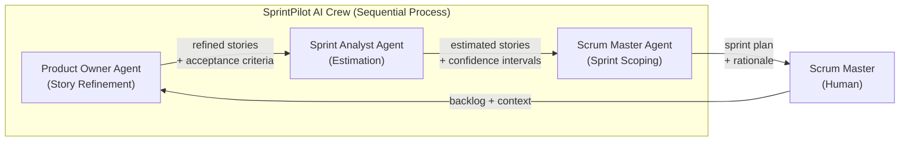
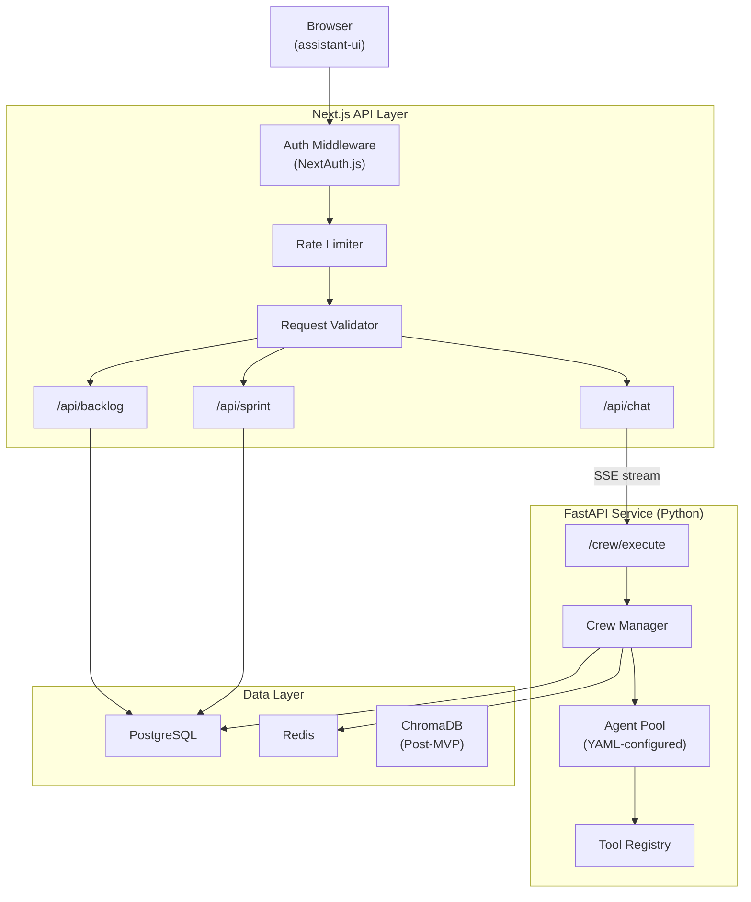
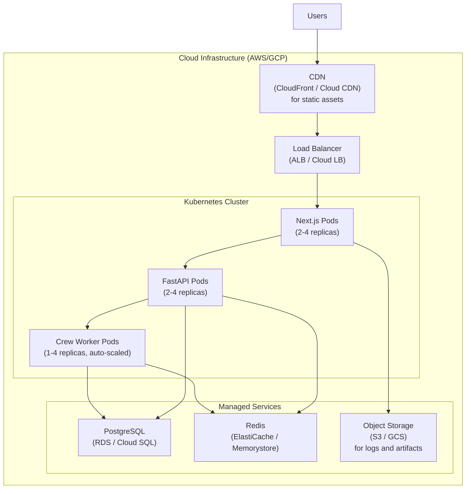
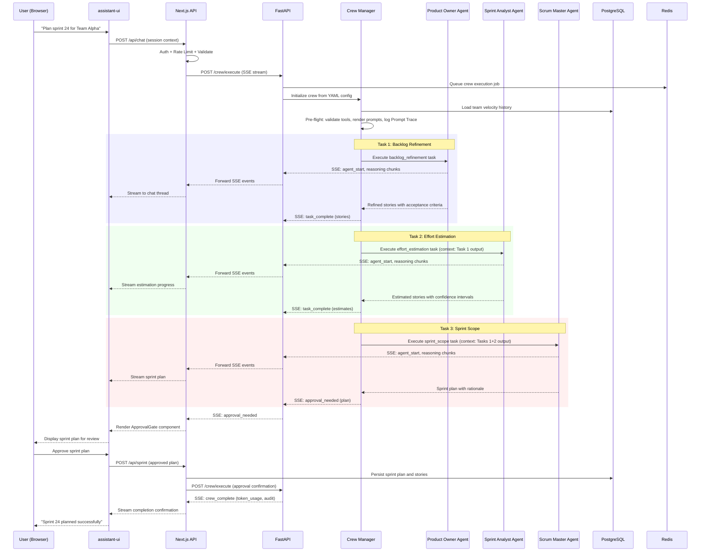

# System Architecture Document: SprintPilot AI

**Product Name**: SprintPilot AI
**Architecture Focus**: AI-native multi-agent sprint planning system built on CrewAI with Next.js + assistant-ui frontend
**Document Status**: Draft v1.0
**Adapter**: CrewAI (AAMAD_ADAPTER=crewai)

---

## 1. MVP Architecture Philosophy & Principles

### MVP Design Principles

**Human-in-the-Loop by Default**: Every critical decision point -- sprint scope commitment, estimation override, story approval -- requires explicit human confirmation before finalization. AI agents handle mechanical overhead (story creation, dependency mapping, velocity forecasting) while humans retain strategic authority. This follows the cognitive amplification model validated in production agile teams (PRD Section 6; MRD Section 3 -- over 60% of teams cite trust and control as primary AI adoption constraints).

**Progressive Autonomy**: The system starts with maximum human oversight (all agent outputs are suggestions requiring approval) and graduates toward greater autonomous execution as trust builds and reliability is demonstrated. Three bounded autonomy tiers govern agent behavior from MVP onward (PRD Section 5):

- *Routine Automated*: Low-risk operations (data retrieval, formatting, backlog sync) execute without human intervention.
- *Checkpoint Confirmation*: Medium-risk operations (story generation, estimation, dependency mapping) present results for human review.
- *Human Required*: High-risk operations (sprint commitment, scope changes, capacity allocation) require explicit approval.

**Transparency and Explainability**: Every agent recommendation includes the reasoning chain, data sources considered, confidence levels, and an override option. Agent execution streams in real time to the UI so users observe reasoning as it happens, reducing perceived latency and building trust (PRD Section 6).

**Observable by Default**: Token accounting, agent execution tracing, and quality metrics are built into the architecture from MVP -- not deferred. Observability is essential for debugging non-deterministic multi-agent behavior and controlling LLM cost (MRD Section 4 -- 62% of enterprise AI projects exceed budgets by 50%+).

**Reproducibility First**: Agent memory is disabled (memory=false) for MVP to ensure deterministic, auditable artifact creation. Every crew execution produces the same output given the same inputs, enabling reliable testing and governance (adapter-crewai rules).

### Core vs. Future Features Decision Framework

| Phase | Scope | Rationale |
| :---- | :---- | :-------- |
| **Phase 1 -- MVP (Weeks 1--12)** | Core multi-agent sprint planning (F1--F4), chat-based UI, FastAPI backend, Jira API scaffolding, basic observability | Prove core value proposition: AI reduces sprint planning overhead by 30--40% with human-in-the-loop trust model |
| **Phase 2 -- Enhanced (Months 4--9)** | Full Jira sync (F7), predictive velocity (F5), cross-sprint patterns (F6), Linear integration, SOC 2 Type I, production observability | Strengthen differentiation and enterprise readiness based on beta feedback |
| **Phase 3 -- Scale (Months 10--18)** | GitHub integration, Slack/Teams workflows, SSO, VPC deployment, multi-team capacity planning (F8--F11), LangGraph adapter evaluation | Enterprise features and horizontal scaling |

**MVP Scope Boundaries** (PRD Section 4, Priority P0):

- Focus on end-to-end sprint planning workflow: backlog intake, story refinement, AI estimation, sprint scope recommendation, human approval.
- Limit to single-user sessions without complex multi-tenant user management.
- Implement basic observability without full APM infrastructure.
- Use SQLite for local development while designing schema for PostgreSQL migration.
- Implement essential security (env-based secrets, input validation) without enterprise-grade features (SSO, VPC, SOC 2).

**Explicit Deferrals**:

- Multi-team capacity planning (F10) -- requires hierarchical crew orchestration not justified for MVP.
- Standup summarization (F8) and retrospective analysis (F9) agents -- expand agent surface area beyond core sprint planning.
- Linear and GitHub integrations (F11) -- prioritize Jira for largest market reach.
- Agent memory (memory=true) -- deferred until Phase 2 when personalization use cases are validated by beta feedback.
- Outcome-based pricing instrumentation -- requires proven agent reliability metrics.

### Technical Architecture Decisions

**Decision 1: Next.js App Router over Pages Router**

App Router provides React Server Components for optimal initial page load, built-in streaming support via React Suspense (critical for real-time agent output display), and co-located API routes within the app directory. The App Router's streaming architecture maps directly to the SSE-based agent response pattern where crew executions run 1--10 minutes and intermediate results must stream to the user in real time (PRD Section 5 -- agent execution latency). Pages Router lacks native streaming support and would require additional abstraction.

**Decision 2: assistant-ui over Custom Chat Interface**

assistant-ui provides a production-grade LLM chat interface with built-in streaming message handling, tool result rendering via custom components, and conversation thread management. Building a custom chat interface would require 4--6 weeks of development for equivalent functionality. assistant-ui's component model allows custom tool components for agent-specific result displays (sprint plans, story cards, estimation confidence intervals) without rebuilding the underlying chat infrastructure (PRD Section 6 -- real-time streaming, feedback loop).

**Decision 3: CrewAI Sequential Process over Hierarchical**

Sequential execution is chosen for MVP because sprint planning follows a natural linear workflow: backlog analysis (Product Owner agent) -> estimation (Sprint Analyst agent) -> sprint scoping (Scrum Master agent). Sequential process provides deterministic execution order, simpler debugging, and predictable token consumption. Hierarchical crews add a manager agent layer that increases complexity, token cost, and non-determinism without benefit for a linear workflow. The adapter pattern supports future migration to hierarchical process if multi-team coordination requires it (PRD Section 3 -- process model; MRD Section 2 -- CrewAI role-based orchestration).

**Decision 4: Python/FastAPI Backend Separate from Next.js**

CrewAI is a Python framework; running it within a Next.js API route would require Python subprocess management or a REST bridge regardless. A dedicated FastAPI service provides async support for long-running crew executions (1--10 minutes), proper Python dependency management, and clean separation of concerns. FastAPI's native async capabilities and SSE support align with the streaming response pattern. The Next.js API layer acts as a thin proxy, handling authentication, rate limiting, and request validation before forwarding to the Python service (PRD Section 3 -- infrastructure specifications).

**Decision 5: SSE (Server-Sent Events) for Streaming**

SSE is chosen over WebSockets for agent response streaming because the communication pattern is unidirectional (server -> client) during crew execution. SSE works natively with HTTP/2, requires no special proxy configuration, and integrates cleanly with assistant-ui's streaming message model. WebSockets would add unnecessary bidirectional complexity for a pattern where the client sends a request and then receives a stream of updates (PRD Section 6 -- real-time streaming).

---

## 2. Multi-Agent System Specification

### Agent Architecture Requirements

SprintPilot AI uses three specialized agents for MVP scope, mapping to real agile team roles. This provides a natural, explainable mental model for users (MRD Section 5 -- multi-agent specialization as defensible moat; PRD Section 1 -- key differentiator).



**Agent 1: Product Owner Agent**

| Attribute | Value |
| :-------- | :---- |
| role | "AI Product Owner for Backlog Grooming and Story Refinement" |
| goal | "Analyze and refine product backlog by breaking down epics into well-formed user stories with clear acceptance criteria, business value scoring, and dependency mapping" |
| backstory | "An experienced product owner who excels at translating business objectives into actionable engineering work. Applies structured decomposition and prioritization frameworks, always grounding decisions in user research and business metrics." |
| tools | [backlog_reader, story_generator, acceptance_criteria_validator, dependency_mapper] |
| llm | OpenAI GPT-4-class (primary), Anthropic Claude (fallback) |
| memory | false |
| allow_delegation | false |
| verbose | false (production) |
| max_iter | 12 |
| max_execution_time | 300 seconds |
| max_retry_limit | 2 |
| respect_context_window | true |

*PRD Traceability*: PRD Section 3 -- Agent 2 definition; PRD Section 4 -- F2 (Automated Backlog Grooming).

**Agent 2: Sprint Analyst Agent**

| Attribute | Value |
| :-------- | :---- |
| role | "AI Sprint Analyst for Estimation and Velocity Forecasting" |
| goal | "Provide data-driven sprint estimation with historical confidence intervals, predict sprint outcomes based on team velocity patterns, and detect cross-sprint anti-patterns for continuous improvement" |
| backstory | "A quantitative analyst specializing in agile metrics and software delivery performance. Combines statistical rigor with practical engineering intuition, always presenting estimates as ranges with explicit confidence levels rather than false precision." |
| tools | [estimation_engine, velocity_forecaster, pattern_detector, metrics_dashboard] |
| llm | OpenAI GPT-4-class (primary), Anthropic Claude (fallback) |
| memory | false |
| allow_delegation | false |
| verbose | false (production) |
| max_iter | 12 |
| max_execution_time | 300 seconds |
| max_retry_limit | 2 |
| respect_context_window | true |

*PRD Traceability*: PRD Section 3 -- Agent 3 definition; PRD Section 4 -- F3 (AI-Assisted Estimation).

**Agent 3: Scrum Master Agent**

| Attribute | Value |
| :-------- | :---- |
| role | "AI Scrum Master for Sprint Planning Facilitation" |
| goal | "Facilitate sprint planning by coordinating agent activities, enforcing agile best practices, identifying impediments, and ensuring sprint scope aligns with team capacity and velocity history" |
| backstory | "A seasoned scrum practitioner with deep experience facilitating sprint planning for distributed engineering teams. Prioritizes team sustainability, predictable delivery, and data-driven decision-making over heroic commitments." |
| tools | [velocity_calculator, capacity_analyzer, sprint_history_reader, impediment_tracker] |
| llm | OpenAI GPT-4-class (primary), Anthropic Claude (fallback) |
| memory | false |
| allow_delegation | false |
| verbose | false (production) |
| max_iter | 12 |
| max_execution_time | 300 seconds |
| max_retry_limit | 2 |
| respect_context_window | true |

*PRD Traceability*: PRD Section 3 -- Agent 1 definition; PRD Section 4 -- F4 (Sprint Scope Recommendation).

### Task Orchestration Specification

Tasks execute sequentially, matching the natural sprint planning workflow defined in PRD Section 2 (User Journey).

**Task 1: Backlog Analysis and Story Refinement**

| Attribute | Value |
| :-------- | :---- |
| id | backlog_refinement |
| description | Analyze imported backlog items, break down epics into well-formed user stories conforming to INVEST principles, generate acceptance criteria, score business value, and map dependencies. |
| agent | Product Owner Agent |
| expected_output | JSON array of refined stories, each containing: title, description, acceptance_criteria (array), business_value_score (1-10), dependencies (array of story IDs), original_epic_id. Target file: runtime output passed to next task via context. |
| context | User-provided backlog items (epics, raw stories) and any team-specific context from the chat session. |
| human_input | false (output reviewed at sprint scope stage) |
| create_directory | true |

**Task 2: Effort Estimation with Confidence Intervals**

| Attribute | Value |
| :-------- | :---- |
| id | effort_estimation |
| description | Estimate effort for each refined story using historical velocity data and similar story analysis. Provide point estimates with confidence ranges and reference comparable historical stories. |
| agent | Sprint Analyst Agent |
| expected_output | JSON array extending Task 1 output with: story_points (integer), confidence_range (object: low, high, confidence_pct), comparable_stories (array of references), estimation_rationale (string). |
| context | [backlog_refinement] -- receives refined stories from Task 1. Team velocity history and sprint data provided via tools. |
| human_input | false (estimates reviewed at sprint scope stage) |

**Task 3: Sprint Scope Recommendation**

| Attribute | Value |
| :-------- | :---- |
| id | sprint_scope |
| description | Generate an optimal sprint scope recommendation based on estimated stories, team capacity (members, availability, absences), historical velocity, and identified dependencies. Produce a complete sprint plan with rationale for inclusion/exclusion of each story. |
| agent | Scrum Master Agent |
| expected_output | Sprint plan object containing: recommended_stories (array with priority order), total_story_points, team_capacity_assessment, velocity_comparison, risk_factors, excluded_stories_with_rationale, overall_confidence_level. Streamed to user for review. |
| context | [backlog_refinement, effort_estimation] -- receives full story data from Tasks 1 and 2. |
| human_input | true (sprint plan requires explicit human approval per PRD Section 4 -- F4 acceptance criteria) |

**Error Handling and Retry Policy**:

- On agent task failure (timeout, context overflow, tool error): retry with exponential backoff up to max_retry_limit (2 retries).
- On persistent failure after retries: degrade gracefully to partial output with a clear "Incomplete -- [reason]" marker. Do not halt the entire crew.
- On context window overflow: halt the specific task, write a Diagnostic with token usage data, and surface to the user via the chat interface.
- Multi-provider LLM fallback: if the primary LLM provider (OpenAI) fails, automatically retry with the fallback provider (Anthropic) before counting against the retry limit (PRD Section 5 -- fault tolerance).

### CrewAI Framework Configuration

All agent and task definitions are externalized to YAML configuration files under a `config/` directory, per adapter-crewai rules. The main orchestration module (`crew.py`) loads these YAML configs at runtime.

| Configuration | Value | Rationale |
| :------------ | :---- | :-------- |
| Process type | Sequential | Deterministic execution for linear sprint planning workflow |
| Memory | false | Reproducibility for MVP; enables deterministic testing |
| Verbose | false (production), true (development) | Minimize token usage in production; enable debugging in dev |
| Max RPM (crew-level) | 60 | Rate limit to control LLM API budget and stabilize throughput |
| Execution mode | ReAct (default) | No function_calling_llm specified; agents use ReAct reasoning |
| CREWAI_STORAGE_DIR | project-scoped path | Prevent cross-project contamination if memory is later enabled |
| YAML config paths | config/agents.yaml, config/tasks.yaml | Externalized per adapter-crewai rules |

**Prompt Transparency**: Before each crew execution, the system generates and logs the full system+user prompts to a Prompt Trace file under `project-context/2.build/logs/`. If CrewAI-injected system instructions conflict with expected output templates, the crew aborts with a Diagnostic (adapter-crewai rules -- prompt shape guard).

---

## 3. Frontend Architecture Specification (Next.js + assistant-ui)

### Technology Stack Requirements

| Technology | Version/Variant | Purpose |
| :--------- | :-------------- | :------ |
| Next.js | 14+ with App Router | Framework: React Server Components, streaming, co-located API routes |
| assistant-ui | Latest stable | LLM chat interface with streaming, tool components, thread management |
| shadcn/ui | Latest stable | Composable UI component library for non-chat UI elements |
| Tailwind CSS | 3.x | Utility-first styling for rapid development and design consistency |
| TypeScript | 5.x | End-to-end type safety across frontend and API layer |
| Zustand | 4.x | Lightweight client-side state management for session and UI state |

*PRD Traceability*: PRD Section 3 -- infrastructure specifications; PRD Section 6 -- interface requirements.

### Application Structure Requirements

```
app/
├── layout.tsx                    # Root layout with providers (theme, auth, state)
├── page.tsx                      # Landing / dashboard page
├── (auth)/
│   ├── login/page.tsx            # Authentication flow
│   └── callback/page.tsx         # OAuth callback handler
├── sprint/
│   ├── layout.tsx                # Sprint planning layout with sidebar
│   ├── page.tsx                  # Sprint planning chat interface (primary)
│   └── [sessionId]/
│       └── page.tsx              # Historical session review
├── backlog/
│   └── page.tsx                  # Backlog view with task tree visualization
├── analytics/
│   └── page.tsx                  # Sprint metrics and velocity dashboard
├── api/
│   ├── chat/
│   │   └── route.ts             # SSE proxy to FastAPI crew endpoint
│   ├── backlog/
│   │   └── route.ts             # Backlog CRUD operations
│   ├── sprint/
│   │   └── route.ts             # Sprint plan operations
│   ├── auth/
│   │   └── [...nextauth]/route.ts  # NextAuth.js handler
│   └── health/
│       └── route.ts             # Health check endpoint
components/
├── chat/
│   ├── SprintPlanningThread.tsx  # assistant-ui thread wrapper
│   ├── AgentMessage.tsx          # Custom agent message renderer
│   ├── StoryCard.tsx             # Tool component: refined story display
│   ├── EstimationDisplay.tsx     # Tool component: confidence interval viz
│   ├── SprintPlanView.tsx        # Tool component: sprint scope recommendation
│   ├── ApprovalGate.tsx          # Human approval interaction component
│   └── FeedbackControls.tsx      # Accept/modify/reject feedback buttons
├── backlog/
│   ├── TaskTree.tsx              # Hierarchical task tree with nesting
│   └── StoryDetail.tsx           # Story detail panel
├── analytics/
│   ├── VelocityChart.tsx         # Sprint velocity trend visualization
│   └── MetricsSummary.tsx        # Key metrics cards
├── layout/
│   ├── Sidebar.tsx               # Navigation sidebar
│   ├── Header.tsx                # Top bar with session controls
│   └── CommandPalette.tsx        # Keyboard shortcut command palette
└── ui/                           # shadcn/ui base components
lib/
├── api-client.ts                 # Typed API client for backend communication
├── stores/
│   ├── session-store.ts          # Zustand store for planning session state
│   └── ui-store.ts               # Zustand store for UI preferences
├── types/
│   ├── agent.ts                  # Agent response type definitions
│   ├── story.ts                  # Story and backlog type definitions
│   └── sprint.ts                 # Sprint plan type definitions
└── utils/
    ├── streaming.ts              # SSE parsing and streaming utilities
    └── formatting.ts             # Data formatting helpers
```

### assistant-ui Integration Specifications

**Streaming Message Handling**: assistant-ui's `useAssistantRuntime` hook connects to the `/api/chat` SSE endpoint. Agent responses stream token-by-token into the chat thread, with intermediate reasoning steps rendered as collapsible sections. The streaming pipeline handles three message types:

1. *Reasoning chunks*: Displayed in a muted, collapsible "Thinking..." section within the message bubble.
2. *Tool results*: Rendered via custom assistant-ui tool components (StoryCard, EstimationDisplay, SprintPlanView).
3. *Final output*: The complete agent response rendered as the primary message content.

**Custom Tool Components**: assistant-ui's tool rendering system displays structured agent outputs inline within the chat:

- `StoryCard`: Renders a refined user story with title, description, acceptance criteria checklist, business value badge, and dependency links. Includes accept/modify/reject feedback buttons.
- `EstimationDisplay`: Renders story point estimates as a confidence interval visualization (bar chart showing low--high range with confidence percentage).
- `SprintPlanView`: Renders the complete sprint scope recommendation as a prioritized list with capacity gauge, velocity comparison, and risk indicators. Includes the human approval gate.
- `ApprovalGate`: A blocking interaction component that pauses the agent workflow until the user explicitly approves, modifies, or rejects the sprint plan.

**Feedback Collection**: Every tool component includes `FeedbackControls` that capture user responses (accept, modify with comments, reject with reason). Feedback events are POSTed to `/api/sprint/feedback` and stored for future model calibration (PRD Section 6 -- feedback loop).

### User Interface Requirements

**Chat-Based Primary Interface** (PRD Section 6): The sprint planning chat occupies the main content area. Users initiate planning sessions via natural language commands (e.g., "Plan sprint 24 for Team Alpha"). The chat thread displays all agent activity, tool results, and approval gates in a single conversational flow.

**Task Tree Visualization** (PRD Section 6): The backlog view renders sprint items as a hierarchical task tree with unlimited nesting depth, preventing the "flat list" problem identified in UX research (MRD Section 3 -- Nean Project). Drag-and-drop reordering is supported for manual prioritization.

**Keyboard-First Workflow**: Full keyboard navigation with command shortcuts:
- `Cmd/Ctrl + K`: Open command palette for quick actions.
- `Cmd/Ctrl + Enter`: Approve current agent recommendation.
- `Cmd/Ctrl + Shift + Enter`: Reject with comment prompt.
- `Esc`: Dismiss current overlay or cancel pending action.

**Responsive Design**: Functional across desktop (1024px+) and tablet (768px+) screen sizes. Mobile is deprioritized for MVP given the complexity of sprint planning workflows requiring multi-panel layouts (PRD Section 6).

**Accessibility**: WCAG 2.1 AA compliance for all core interactions. Semantic HTML, ARIA labels on interactive elements, keyboard focus management, and sufficient color contrast ratios (PRD Section 6).

---

## 4. Backend Architecture Specification

### API Architecture Requirements

The backend consists of two tiers: a Next.js API layer for frontend-facing concerns and a Python/FastAPI service for CrewAI agent orchestration.



**Next.js API Routes** (thin proxy layer):

| Route | Method | Purpose |
| :---- | :----- | :------ |
| `/api/chat` | POST | Initiates a crew execution; returns an SSE stream of agent activity |
| `/api/backlog` | GET, POST, PUT, DELETE | CRUD operations for backlog items synced from Jira |
| `/api/sprint` | GET, POST, PUT | Sprint plan operations (create, retrieve, update approval status) |
| `/api/sprint/feedback` | POST | Capture user feedback on agent outputs |
| `/api/auth/[...nextauth]` | GET, POST | Authentication flow via NextAuth.js |
| `/api/health` | GET | Health check for load balancer and monitoring |

**FastAPI Service Routes** (agent orchestration):

| Route | Method | Purpose |
| :---- | :----- | :------ |
| `/crew/execute` | POST | Execute a sprint planning crew; streams results via SSE |
| `/crew/status/{session_id}` | GET | Query execution status for a running crew |
| `/crew/cancel/{session_id}` | POST | Cancel a running crew execution |
| `/tools/validate` | POST | Pre-flight tool configuration validation |
| `/health` | GET | Service health and dependency status |

**Request/Response Data Structures**:

Crew execution request:
```json
{
  "session_id": "uuid",
  "team_id": "string",
  "backlog_items": [{ "id": "string", "type": "epic|story", "title": "string", "description": "string" }],
  "team_context": {
    "members": [{ "name": "string", "capacity_pct": 100, "absences": [] }],
    "sprint_duration_days": 10,
    "velocity_history": [{ "sprint_id": "string", "completed_points": 0 }]
  },
  "preferences": { "max_stories": 20, "estimation_model": "fibonacci" }
}
```

Crew execution SSE event types:
```
event: agent_start      data: { "agent": "product_owner", "task": "backlog_refinement" }
event: reasoning        data: { "agent": "product_owner", "content": "Analyzing epic..." }
event: tool_result      data: { "agent": "product_owner", "tool": "story_generator", "result": {...} }
event: task_complete    data: { "task": "backlog_refinement", "output": {...} }
event: approval_needed  data: { "task": "sprint_scope", "plan": {...} }
event: crew_complete    data: { "session_id": "uuid", "final_output": {...}, "token_usage": {...} }
event: error            data: { "code": "string", "message": "string", "recoverable": true }
```

**Rate Limiting and Security Middleware**:
- Rate limiting: 10 crew executions per user per hour (burst protection during sprint planning windows).
- Request validation: JSON schema validation on all request bodies using Pydantic (FastAPI) and Zod (Next.js).
- Input sanitization: Strip potential prompt injection tokens from user-provided backlog text before passing to agents.
- CORS: Restrict to known frontend origins.
- Security headers: Strict-Transport-Security, X-Content-Type-Options, X-Frame-Options.

### Database Architecture Specification

**PostgreSQL Schema** (structured sprint and user data):

| Table | Purpose | Key Columns |
| :---- | :------ | :---------- |
| users | User accounts and preferences | id, email, name, role, created_at |
| teams | Team definitions and configuration | id, name, default_sprint_duration, created_at |
| team_members | Team membership with capacity | id, team_id (FK), user_id (FK), capacity_pct |
| sprints | Sprint definitions and status | id, team_id (FK), name, start_date, end_date, status, velocity_target |
| stories | User stories (synced from Jira and agent-generated) | id, sprint_id (FK), epic_id, title, description, acceptance_criteria (JSONB), story_points, confidence_range (JSONB), status, source (jira\|agent\|manual) |
| planning_sessions | Sprint planning chat sessions | id, team_id (FK), sprint_id (FK), status, started_at, completed_at, token_usage (JSONB) |
| session_messages | Chat messages within a planning session | id, session_id (FK), role (user\|agent\|system), agent_name, content, tool_results (JSONB), created_at |
| feedback | User feedback on agent outputs | id, session_id (FK), story_id (FK), action (accept\|modify\|reject), comment, created_at |
| jira_connections | Jira OAuth tokens and sync metadata | id, team_id (FK), access_token_enc, refresh_token_enc, jira_site_url, last_sync_at |

**Development Database**: SQLite via Prisma for local development, with schema designed for zero-friction PostgreSQL migration in production (PRD Section 3).

**ChromaDB** (post-MVP): Vector storage for agent memory when memory=true is enabled in Phase 2. Will store embeddings of past sprint data, story patterns, and team velocity profiles for retrieval-augmented agent reasoning.

**Redis**:
- *Session caching*: Active planning session state for fast retrieval.
- *Job queuing*: Async crew execution queue with priority handling for concurrent planning sessions.
- *Rate limiting*: Sliding window counters for API rate limits.
- *SSE connection state*: Track active SSE connections for cleanup on disconnect.

**Data Retention and Cleanup**:
- Planning session messages: Retained for 12 months, then archived.
- Sprint and story data: Retained indefinitely (core business data).
- Agent execution logs: Retained for 90 days in active storage, archived to cold storage.
- Redis cache entries: TTL-based expiration (session state: 24 hours, rate limit counters: 1 hour).

### CrewAI Integration Layer Requirements

The Python service layer manages CrewAI crew lifecycle:

1. **Configuration Loading**: At startup, parse `config/agents.yaml` and `config/tasks.yaml` to construct agent and task objects. Validate all tool references are resolvable. Fail fast with diagnostic listing missing tools if validation fails (adapter-crewai rules).

2. **Tool Registry**: Tools are registered at service startup and bound to agents per YAML configuration. Only whitelisted tools are permitted per agent. Tool parameters containing secrets are loaded from environment variables; secrets are never logged in Prompt Trace.

3. **Crew Execution**: `CrewManager` constructs a `Crew` instance per planning session, executes via `crew.kickoff()`, and streams intermediate results via SSE. Token usage is captured from `CrewOutput.raw` and logged to the Audit trail.

4. **Prompt Trace**: Before each execution, the full rendered system+user prompt is logged to `project-context/2.build/logs/prompt-trace-{session_id}.md`. If injected CrewAI instructions conflict with expected output templates, execution aborts with a Diagnostic.

5. **Step Callback Logging**: Intermediate reasoning and tool calls are captured via `step_callback` and written to `project-context/2.build/logs/trace-{session_id}.log`, separate from the final artifact.

### Authentication & Security Specifications

**User Authentication**: NextAuth.js with the following providers:
- Email/password for MVP (credential provider).
- OAuth 2.0 providers (Google, GitHub) for convenience.
- Jira OAuth 2.0 for PM tool integration (PRD Section 3 -- integration requirements).

**API Key Management**: All LLM provider API keys (OpenAI, Anthropic) and third-party service credentials are loaded exclusively from environment variables. A `.env.example` file documents all required variables without values (adapter-crewai rules -- security guidelines).

**Role-Based Access Control (RBAC)**: Three roles for MVP:
- *Admin*: Full access including team configuration, integration setup, user management.
- *Planner*: Sprint planning sessions, backlog management, feedback submission.
- *Viewer*: Read-only access to sprint plans, analytics, and session history.

*PRD Traceability*: PRD Section 5 -- authentication (OAuth 2.0), access control (RBAC), secret management.

---

## 5. DevOps & Deployment Architecture

### CI/CD Pipeline Requirements

**GitHub Actions Workflow**:

| Stage | Trigger | Actions |
| :---- | :------ | :------ |
| Lint & Type Check | Push to any branch | ESLint, TypeScript compiler, Python mypy/ruff |
| Unit Tests | Push to any branch | Jest (frontend), pytest (backend), coverage thresholds |
| Integration Tests | Push to main, PR to main | API endpoint tests, database migration tests |
| Build | Push to main | Next.js production build, Python package build, Docker image build |
| Deploy to Staging | Push to main | Deploy containers to staging environment, run smoke tests |
| Deploy to Production | Manual approval after staging validation | Blue-green deployment to production, health check verification |
| E2E Tests | Post-staging deploy | Playwright end-to-end tests against staging |

**Deployment Gates**: Production deployment requires passing all automated tests plus manual approval from a team member. Rollback procedure: revert to previous container image via blue-green swap (PRD Section 8).

### Infrastructure Architecture



**Local Development**: Docker Compose with containers for Next.js (hot reload), FastAPI (hot reload), PostgreSQL, and Redis. SQLite available as a zero-dependency alternative for rapid local testing.

**Production**: Kubernetes on AWS EKS or GCP GKE with:
- Next.js pods: 2--4 replicas, 512MB memory, 0.5 vCPU each.
- FastAPI pods: 2--4 replicas, 1GB memory, 1 vCPU each.
- Crew Worker pods: 1--4 replicas (auto-scaled based on queue depth), 2GB memory, 1 vCPU each. These handle long-running crew executions.

**Alternative MVP Deployment**: For early MVP before K8s maturity, AWS App Runner or GCP Cloud Run provide simpler container hosting with automatic scaling. Migrate to K8s when operational complexity justifies it (PRD Section 3 -- cloud-native, designed for portability).

### Infrastructure as Code Requirements

Terraform modules organized by concern:
- `infra/modules/networking` -- VPC, subnets, security groups.
- `infra/modules/database` -- PostgreSQL instance, Redis cluster.
- `infra/modules/compute` -- Kubernetes cluster, node pools, autoscaling policies.
- `infra/modules/storage` -- S3/GCS buckets for logs and artifacts.
- `infra/modules/monitoring` -- CloudWatch/Stackdriver dashboards, alert policies.

Separate state files for staging and production environments. All sensitive values (database passwords, API keys) managed via cloud secret managers (AWS Secrets Manager / GCP Secret Manager), referenced in Terraform but never committed to source control.

### Monitoring & Observability Specifications

| Layer | Tool | What Is Monitored |
| :---- | :--- | :---------------- |
| Agent Execution | Langfuse or LangSmith | Per-agent latency, token usage per task, reasoning trace, tool call frequency, crew execution end-to-end time |
| Application | Structured logging (JSON) | API request/response logs, error rates, session lifecycle events |
| Infrastructure | CloudWatch / Stackdriver | CPU, memory, network utilization; pod restart counts; database connection pool health |
| User Analytics | PostHog or Mixpanel (post-MVP) | Session frequency, feature adoption, feedback submission rates |
| Cost | Custom dashboard | LLM API spend per session, per agent, per day; budget threshold alerts |

**Alerting Rules**:
- Crew execution failure rate > 10% over 5-minute window.
- LLM API cost exceeds daily budget threshold.
- API p95 latency > 1 second for non-agent endpoints.
- Pod restart count > 3 within 10 minutes.
- Database connection pool utilization > 80%.

*PRD Traceability*: PRD Section 3 -- observability (Langfuse/LangSmith); PRD Section 8 -- basic observability from MVP.

---

## 6. Data Flow & Integration Architecture

### Request/Response Flow Specification



**Caching Strategy**:
- Team velocity history: Cached in Redis with 1-hour TTL; invalidated on new sprint completion.
- Backlog items: Cached in Redis with 15-minute TTL; invalidated on Jira sync webhook.
- Static UI assets: CDN-cached with content-hash-based cache busting.

### External Integration Requirements

**Jira Cloud API (MVP -- F7 scaffolding, full sync in Phase 2)**:

| Integration Point | Direction | Data |
| :---------------- | :-------- | :--- |
| Backlog import | Jira -> SprintPilot | Epics, stories, subtasks with metadata (status, priority, labels, assignee) |
| Sprint push | SprintPilot -> Jira | Finalized sprint plan: story assignments, sprint scope, story point estimates |
| Webhook listener | Jira -> SprintPilot | Real-time updates on story status changes, new items created |
| Conflict resolution | Bidirectional | Last-write-wins with user notification when conflicts detected |

Authentication: OAuth 2.0 (3LO) with token refresh. Connection setup via the SprintPilot UI with Atlassian marketplace app registration.

**Planned Integrations (Post-MVP)** (PRD Section 3):
- Linear API: Bidirectional sync for engineering-focused teams.
- GitHub API: Repository context for code-informed estimation.
- Slack/Teams: Sprint planning notifications and approval workflows.
- CI/CD Pipelines: Deployment feedback for velocity calibration.

### Analytics & Feedback Architecture

**User Interaction Tracking**: Event-based tracking for key user actions:
- Planning session started/completed/abandoned.
- Agent recommendation accepted/modified/rejected (per story and per sprint plan).
- Time spent reviewing agent outputs before decision.
- Feature usage frequency (chat commands, backlog view, analytics dashboard).

**Feedback Data Model**: Stored in the `feedback` table with full provenance:
- Links to the specific story, estimation, or sprint plan that was evaluated.
- Action taken (accept/modify/reject) with optional user comment.
- Timestamp for temporal analysis of trust-building patterns.

**Privacy Compliance**: User interaction data is anonymized for aggregate analytics. Individual-level data is accessible only to the user's team admin. No sprint content (story descriptions, business logic) is sent to analytics services -- only event metadata (PRD Section 5 -- data protection; MRD Section 4 -- privacy).

*PRD Traceability*: PRD Section 4 -- F7 (Jira Bidirectional Sync); PRD Section 6 -- feedback loop; PRD Section 7 -- user experience metrics.

---

## 7. Performance & Scalability Specifications

### Performance Requirements

| Metric | MVP Target | Production Target | Source |
| :----- | :--------- | :---------------- | :----- |
| Agent task completion rate | >90% | >95% | PRD Section 7 |
| Average crew execution time (3-agent sequential) | <5 minutes | <3 minutes | PRD Section 7 |
| API response time (non-agent endpoints) | <500ms p95 | <200ms p95 | PRD Section 5 |
| SSE first-byte latency (crew start to first event) | <3 seconds | <1 second | Derived from UX requirements |
| Concurrent planning sessions | 10 | 50 | PRD Section 5 |
| System uptime | 99.5% | 99.9% | PRD Section 5 |

**Agent Execution Latency Breakdown** (target budget for a typical 3-agent sprint planning session):

| Phase | Target Time | Notes |
| :---- | :---------- | :---- |
| Request processing and crew initialization | <2 seconds | Config loading, prompt rendering, pre-flight checks |
| Task 1: Backlog refinement (Product Owner) | 60--120 seconds | Scales with number of epics/stories in input |
| Task 2: Effort estimation (Sprint Analyst) | 30--60 seconds | Scales with number of stories from Task 1 |
| Task 3: Sprint scope recommendation (Scrum Master) | 30--60 seconds | Fixed scope: one sprint plan per execution |
| Post-processing and audit logging | <2 seconds | Token accounting, Prompt Trace write, result persistence |
| **Total crew execution** | **~2--5 minutes** | Intermediate results stream to user throughout |

### Scalability Architecture

**Horizontal Scaling Triggers**:

| Resource | Scale-Out Trigger | Scale-In Trigger | Max Replicas |
| :------- | :---------------- | :--------------- | :----------- |
| Next.js pods | CPU > 70% for 2 minutes | CPU < 30% for 5 minutes | 4 |
| FastAPI pods | CPU > 70% for 2 minutes | CPU < 30% for 5 minutes | 4 |
| Crew Worker pods | Redis queue depth > 5 jobs | Queue empty for 10 minutes | 4 (MVP) |

**Load Management**: Redis-based job queue for crew executions. During peak sprint planning windows (Monday mornings, sprint boundaries), jobs queue with priority ordering. Users see a "Planning in progress..." indicator with queue position if their session is queued (PRD Section 5 -- throughput, burst handling).

**Database Scaling Path**:
- MVP: Single PostgreSQL instance with connection pooling (PgBouncer).
- Phase 2: Read replicas for analytics queries.
- Phase 3: Evaluate sharding by team_id if data volume warrants.

### Resource Optimization Specifications

**LLM Token Cost Controls** (PRD Section 5 -- token cost controls; PRD Section 7 -- <$2/session target):

| Control | Implementation |
| :------ | :------------- |
| Per-agent token budget | max_iter=12 per agent; max_execution_time=300s |
| Per-session cost ceiling | Circuit breaker aborts crew if cumulative token cost exceeds $5.00 per session |
| Model tier optimization | Routine tasks (formatting, data retrieval) use GPT-3.5-class models; complex reasoning (estimation, scope analysis) uses GPT-4-class models |
| Crew-level RPM limit | max_rpm=60 to prevent burst API charges |
| Token usage logging | Every crew execution logs per-agent and total token counts in Audit for cost tracking |

**Infrastructure Cost Targets** (MVP):

| Resource | Monthly Estimate | Notes |
| :------- | :--------------- | :---- |
| LLM API (OpenAI) | $500--1,500 | Based on 250--750 planning sessions at ~$2/session |
| Cloud compute (K8s) | $200--400 | 3-node cluster with autoscaling |
| PostgreSQL (managed) | $50--100 | Small instance sufficient for MVP data volume |
| Redis (managed) | $30--50 | Single-node for caching and queuing |
| **Total MVP infrastructure** | **$780--2,050/month** | Budget 2.5x for production readiness (MRD Section 4) |

*PRD Traceability*: PRD Section 5 -- performance, scalability, cost scaling; PRD Section 7 -- technical metrics; MRD Section 4 -- AI-native cost structure.

---

## 8. Security & Compliance Architecture

### Security Framework Requirements

**Encryption**:
- At rest: AES-256 encryption for all data in PostgreSQL (via database-level encryption or cloud-managed encryption), Redis (encrypted at rest), and object storage (S3 SSE / GCS CMEK).
- In transit: TLS 1.3 for all external communications (browser-to-server, server-to-LLM APIs, server-to-Jira). Internal cluster communication uses mTLS where supported.

*PRD Traceability*: PRD Section 5 -- AES-256 at rest, TLS 1.3 in transit.

**Authentication and Authorization**:

| Concern | Implementation |
| :------ | :------------- |
| User authentication | NextAuth.js with email/password (MVP) and OAuth providers |
| Session management | JWT tokens with 24-hour expiry; refresh tokens with 7-day expiry |
| API authentication | Bearer token for Next.js API routes; internal service-to-service auth via shared secrets in env vars |
| Jira integration auth | OAuth 2.0 (3LO) with encrypted token storage |
| RBAC enforcement | Middleware-level role checks on all API routes; three roles (Admin, Planner, Viewer) |

**Input Validation and Sanitization**:
- All API request bodies validated against JSON schemas (Pydantic for FastAPI, Zod for Next.js).
- User-provided text (backlog descriptions, chat messages) sanitized to neutralize prompt injection tokens before passing to CrewAI agents (adapter-crewai rules -- sanitize quoted inputs).
- File upload disabled for MVP.

**Secret Management**:
- All API keys (OpenAI, Anthropic, Jira) loaded from environment variables.
- `.env.example` documents all required variables without values.
- Production secrets stored in AWS Secrets Manager / GCP Secret Manager, injected into container environment at runtime.
- Secrets never appear in logs, Prompt Trace, or agent outputs (adapter-crewai rules).

**API Security**:
- Rate limiting: 10 crew executions/user/hour, 100 API requests/user/minute.
- CORS: Allowlist restricted to known frontend origins.
- Security headers: HSTS, X-Content-Type-Options: nosniff, X-Frame-Options: DENY, Content-Security-Policy.
- Vulnerability scanning: Dependabot (npm), Safety (Python) in CI pipeline.

### Data Privacy & Compliance

**Data Handling**:
- Sprint artifacts (story descriptions, business logic) are proprietary data. LLM API calls transmit this data to provider endpoints subject to provider data processing agreements (PRD Section 5 -- LLM data privacy).
- Architecture designed to support on-premise/VPC LLM deployment for regulated industries in future phases.
- User data (email, name) subject to standard data protection. No personal data sent to LLM providers.

**Compliance Roadmap**:

| Standard | Timeline | Priority | Notes |
| :------- | :------- | :------- | :---- |
| Basic security hygiene (encryption, auth, input validation) | MVP | P0 | Table stakes for any production deployment |
| SOC 2 Type I | Months 4--9 (Phase 2) | P1 | Initiate audit preparation; required for enterprise sales |
| SOC 2 Type II | Months 10--18 (Phase 3) | P1 | 6--12 month certification process (MRD Section 4) |
| GDPR compliance | Phase 2 | P1 | European market expansion; data subject rights, consent management |
| EU AI Act compliance | Phase 3 | P2 | Differentiation opportunity in European market (PRD Section 5) |

**Audit Logging**: All security-relevant events (authentication, authorization decisions, data access, configuration changes) logged with tamper-evident timestamps. Audit log retention: 12 months minimum for compliance.

*PRD Traceability*: PRD Section 5 -- security and compliance; MRD Section 4 -- SOC 2 timeline, GDPR, EU AI Act.

---

## 9. Testing & Quality Assurance Specifications

### Testing Strategy Requirements

| Test Layer | Scope | Framework | Coverage Target |
| :--------- | :---- | :-------- | :-------------- |
| Unit Tests (Frontend) | React components, utility functions, state stores | Jest + React Testing Library | >80% line coverage |
| Unit Tests (Backend - Next.js) | API route handlers, middleware, validation | Jest | >80% line coverage |
| Unit Tests (Backend - Python) | CrewAI crew configuration, tool implementations, data transformations | pytest | >80% line coverage |
| Integration Tests | API endpoints with database, CrewAI crew execution with mock LLM, Jira API mock | pytest + httpx (Python), supertest (Next.js) | All critical paths |
| End-to-End Tests | Complete sprint planning workflow from UI to agent output | Playwright | Core user flows (planning session, approval, feedback) |
| Performance Tests | API latency under load, crew execution time benchmarks | k6 or Locust | Validate targets from Section 7 |
| Security Tests | Dependency vulnerability scanning, OWASP Top 10 checks | Dependabot, Safety, OWASP ZAP (post-MVP) | Zero critical/high vulnerabilities |

**CrewAI-Specific Testing**:
- Mock LLM responses for deterministic unit testing of crew configuration and task orchestration.
- Validate that YAML agent/task configurations parse correctly and all tool references resolve.
- Test sequential task context passing: verify Task 2 receives Task 1 output, Task 3 receives Tasks 1+2 output.
- Test error handling: simulate agent timeout, context overflow, and LLM provider failure.
- Validate token budget enforcement: ensure circuit breaker triggers at configured thresholds.

### Quality Gates & Validation

**Pre-Deployment Gates** (enforced in CI pipeline):

| Gate | Criteria | Blocking |
| :--- | :------- | :------- |
| Lint pass | Zero ESLint errors (frontend), zero ruff errors (backend) | Yes |
| Type check pass | Zero TypeScript compiler errors, zero mypy errors | Yes |
| Unit test pass | All tests pass, coverage thresholds met | Yes |
| Integration test pass | All critical path tests pass | Yes |
| Build success | Next.js production build and Docker image build complete without errors | Yes |
| Security scan | Zero critical/high vulnerabilities in dependencies | Yes |
| E2E test pass (staging) | Core user flows pass against staging environment | Yes (for production deploy) |

**Agent Output Quality Validation**:
- Expected output format validation: verify agent outputs conform to the JSON schemas defined in task configurations.
- Template heading validation: for any Markdown-formatted agent output, verify required headings are present (adapter-crewai rules -- quality gates).
- Guardrail functions: automated validation on high-risk outputs (sprint plan story point totals, capacity calculations) to catch numerical errors before presenting to users.

**User Acceptance Testing Criteria** (PRD Section 9 -- beta testing):
- End-to-end sprint planning flow completes without errors: backlog import -> story refinement -> estimation -> scope recommendation -> human approval.
- Agent recommendation relevance: >60% acceptance rate during beta testing.
- Sprint planning time reduction: >30% compared to manual planning baseline.
- Zero data loss or corruption incidents during beta period.

*PRD Traceability*: PRD Section 8 -- testing framework (Jest, Playwright); PRD Section 9 -- beta success metrics.

---

## 10. MVP Launch & Feedback Strategy

### Beta Testing Framework

**Target Beta Users** (PRD Section 9): 3--5 agile engineering teams (50--200 developers each) currently using Jira for sprint planning, practicing scrum with 2-week sprints, willing to provide structured feedback, and experiencing measurable sprint planning pain (>2 hours per planning session).

**Beta Program Structure**:

| Week | Activity |
| :--- | :------- |
| Week 1 | Onboarding: Jira connection setup, team configuration, walkthrough of chat-based planning |
| Week 2--3 | Sprint 1 with SprintPilot AI: full planning session with all three agents, high-touch support |
| Week 4--5 | Sprint 2 with SprintPilot AI: reduced support, in-app feedback collection active |
| Week 6 | Beta retrospective: structured feedback session, NPS survey, feature prioritization input |

**Feedback Collection Mechanisms**:
- In-app: Accept/modify/reject buttons on every agent output with optional comment field.
- Weekly: Structured 30-minute feedback sessions with beta team leads.
- End-of-beta: Comprehensive survey covering usability, trust, time savings, and feature requests.
- Passive: Usage analytics tracking session frequency, completion rates, and feature adoption.

**Feature Flags**: Gradual rollout of new capabilities during beta using feature flags (LaunchDarkly or environment-variable-based for MVP). Enables per-team feature enablement and rapid rollback if issues emerge.

### User Experience Optimization

**Onboarding Flow**:
1. Connect Jira workspace (OAuth flow with guided setup).
2. Configure team (add members, set sprint duration, import velocity history).
3. Guided first planning session: interactive tutorial overlay explaining each agent's role and the approval workflow.
4. Post-session summary: highlight time saved, stories created, and estimation quality.

**Progressive Autonomy Ramp** (PRD Section 6):
- Weeks 1--2: All agent outputs require explicit approval. Every recommendation includes full reasoning and data sources.
- Weeks 3--4: Low-risk outputs (story formatting, acceptance criteria suggestions) auto-apply with undo option. Medium/high-risk outputs still require approval.
- Month 2+: Based on acceptance rate data, offer to auto-approve story refinements for teams with >80% historical acceptance. Sprint scope always requires human approval.

**Help System**: Contextual help tooltips on chat commands, agent output components, and approval gates. Link to documentation for detailed workflow guides. "Ask SprintPilot" command for in-chat help.

### Business Metrics & Analytics

| Metric | MVP Target | 6-Month Target | Measurement |
| :----- | :--------- | :-------------- | :---------- |
| Beta teams enrolled | 3--5 teams | 20+ teams | Team registration count |
| Monthly active teams | 3 | 15 | Teams with >= 1 planning session/month |
| Sprint planning sessions per team/month | 2+ | 4+ (bi-weekly sprints) | Session completion events |
| Story creation time reduction | 30--40% | 40--60% | Time comparison: manual vs AI-assisted (self-reported + session timing) |
| Sprint planning session time reduction | 20--30% | 40--50% | Session duration analytics |
| Agent recommendation acceptance rate | >60% | >75% | Feedback event analysis |
| Human override rate | <40% | <25% | Feedback event analysis (lower is better) |
| NPS | >30 | >50 | End-of-sprint survey |
| Task completion rate (finish planning) | >95% | >99% | Session started vs completed |
| LLM cost per session | <$2.00 | <$1.00 | Token accounting from Audit |

*PRD Traceability*: PRD Section 7 -- business, technical, and UX metrics; PRD Section 9 -- beta testing plan, success metrics.

---

## Implementation Guidance for AI Development Agents

### Phase 2 Development Priorities

Development follows the AAMAD modular workflow. Each module is developed in an isolated context:

1. **Module 1 -- Core Configuration**: CrewAI agent and task definitions in YAML (`config/agents.yaml`, `config/tasks.yaml`), tool implementations, crew orchestration (`crew.py`). Success criteria: `crew.kickoff()` executes successfully with mock inputs.

2. **Module 2 -- API Integration**: FastAPI service with crew execution endpoint, SSE streaming, Next.js API proxy routes. Success criteria: API endpoints return valid streamed responses.

3. **Module 3 -- Frontend Integration**: Next.js App Router pages, assistant-ui chat thread, custom tool components, approval gate. Success criteria: Frontend displays agent outputs and handles user interaction correctly.

4. **Module 4 -- Validation**: End-to-end testing, performance validation, security review. Success criteria: Complete sprint planning workflow functions end-to-end.

### Critical Architecture Decisions to Implement

- Use Server Components for data-fetching pages (backlog view, analytics) and Client Components for interactive elements (chat thread, approval gates, feedback buttons).
- Implement error boundaries at the page and chat-message level with meaningful fallback UI.
- Design the PostgreSQL schema with team_id partitioning awareness for future multi-tenant scaling.
- Structure API routes with middleware composition (auth -> rate limit -> validate -> handler) for consistent security posture.
- Configure assistant-ui with custom runtime adapters for the SSE-based streaming pattern.
- Define shared TypeScript types in `lib/types/` and Pydantic models in the Python service for end-to-end type alignment.

### MVP Scope Boundaries

- Focus on core sprint planning workflow: backlog intake -> story refinement -> estimation -> scope recommendation -> approval.
- Limit to single-team sessions; multi-team coordination is a Phase 3 feature.
- Implement Jira API scaffolding (connection setup, basic import) with full bidirectional sync in Phase 2.
- Use SQLite for development; design schema for PostgreSQL migration.
- Implement essential security without enterprise features (SSO, VPC, SOC 2 are Phase 2--3).

---

## Architecture Validation Checklist

- [ ] All PRD functional requirements (F1--F4 MVP, F5--F7 Enhanced, F8--F11 Future) mapped to architectural components
- [ ] CrewAI agents designed for sprint planning domain with explicit roles, goals, backstories, tools, and constraints
- [ ] assistant-ui integration supports required interaction patterns: streaming, tool components, approval gates, feedback
- [ ] Next.js App Router architecture optimized for streaming performance and SEO (where applicable)
- [ ] Database schema supports sprint planning queries, feedback tracking, and future multi-tenant scaling
- [ ] API design follows RESTful principles with SSE for streaming; proper error handling and rate limiting
- [ ] Security measures appropriate for MVP (encryption, auth, RBAC, secret management) with clear compliance roadmap
- [ ] CI/CD pipeline supports rapid iteration with automated quality gates
- [ ] Monitoring and observability provide agent execution visibility, token cost tracking, and infrastructure health
- [ ] Architecture supports transition from MVP to production-scale system (K8s, managed databases, multi-region)

---

## Sources

1. GlobeNewsWire, "AI in Project Management Market Outlook 2025-2030," October 2025 -- via PRD, MRD
2. SkyQuest, "AI in Project Management Market Size, Share, and Business Forecast 2026-2033," 2026 -- via PRD, MRD
3. AI PM Tools Directory, "AI Adoption Statistics in Project Management (2026)," 2026 -- via PRD, MRD
4. AI PM Tools Directory, "Best AI Project Management Tools in 2026: The Definitive Ranking," 2026 -- via PRD, MRD
5. Zapier, "State of Agentic AI Adoption Survey 2026," 2026 -- via PRD, MRD
6. Nylas, "Agentic AI Report 2026," 2026 -- via PRD, MRD
7. Nylas, "The State of Agentic AI in 2026: What Teams Are Actually Shipping," 2026 -- via PRD, MRD
8. AgentRank, "CrewAI Review: Is the Multi-Agent Framework Worth It in 2026?," 2026 -- via PRD, MRD
9. Data4AI, "CrewAI Review (2026) -- Architecture and Alternatives," 2026 -- via PRD, MRD
10. Korvus Labs, "How to Calculate the Total Cost of Ownership for Enterprise AI Agents," 2026 -- via PRD, MRD
11. CloudZero, "How To Design AI-Native SaaS Architecture That Scales," 2026 -- via PRD, MRD
12. Leiga, "AI-Powered Sprint Planning in 2026: What Developers Need to Know," 2026 -- via PRD, MRD
13. Kollabe, "AI in Agile Project Management: What's Actually Working in 2026," 2026 -- via PRD, MRD
14. SprintiQ AI / Medium, "AI-Augmented Sprint Planning: How Machine Intelligence Amplifies Agile Performance," 2025 -- via PRD, MRD
15. Nean Project / Medium, "Frictionless Project Management: Task Trees, AI Planning, and Real-Time Collaboration," February 2026 -- via PRD, MRD
16. Monetizely, "The 2026 Guide to SaaS, AI, and Agentic Pricing Models," 2026 -- via PRD, MRD
17. Deloitte Insights, "SaaS Meets AI Agents," 2026 -- via PRD, MRD
18. Chargebee, "Selling Intelligence: The 2026 Playbook For Pricing AI Agents," 2026 -- via PRD
19. Zylos Research, "AI Agents in Production: Deployment, Monitoring, and Scaling," January 2026 -- via MRD
20. Crewship, "How to Deploy CrewAI to Production," 2026 -- via MRD
21. Articsledge, "How to Build AI SaaS in 2026: Complete Technical Guide," 2026 -- via MRD
22. Swept AI, "Observability for Multi-Agent AI Systems," 2026 -- via MRD

---

## Assumptions

1. **CrewAI sequential process sufficiency**: Sequential task execution is sufficient for the three-agent sprint planning workflow. If future requirements demand parallel agent execution (e.g., simultaneous estimation by multiple analysts), the adapter pattern supports migration to hierarchical or custom process types.

2. **SSE streaming viability**: Server-Sent Events provide adequate real-time streaming for crew executions lasting 1--10 minutes. If SSE proves unreliable for long-duration connections (proxy timeouts, mobile network interruptions), WebSocket upgrade path exists with manageable refactoring effort.

3. **YAML configuration externalization**: CrewAI agent and task definitions in YAML files provide sufficient expressiveness for MVP configuration. If complex conditional logic is needed at the configuration level, Python-based configuration with YAML overrides can be introduced without breaking the existing pattern.

4. **SQLite-to-PostgreSQL migration path**: Prisma ORM abstracts database differences sufficiently that the SQLite development schema migrates to PostgreSQL production without schema redesign. Tested with representative data volumes before production deployment.

5. **assistant-ui extensibility**: assistant-ui's tool component system supports the custom rendering requirements for sprint planning artifacts (story cards, estimation displays, approval gates). Evaluated through prototype during Module 3 development.

6. **LLM cost trajectory**: Token pricing for GPT-4-class models continues its deflationary trend. The $2/session cost target is based on current pricing; if pricing increases, model tier optimization and prompt compression will be required. (Inherited from PRD Assumption 2.)

7. **Three-agent architecture sufficiency**: Three specialized agents (Product Owner, Sprint Analyst, Scrum Master) cover the core sprint planning workflow. Additional agents (e.g., QA Agent, DevOps Agent) are deferred to post-MVP based on beta feedback. (Inherited from PRD Section 3.)

8. **Single-tenant MVP**: MVP serves one organization at a time without data isolation between teams. Multi-tenant architecture with team_id partitioning is a Phase 2 concern. (Inherited from PRD Open Question 7.)

---

## Open Questions

1. **User stories not yet defined**: No user stories exist in `project-context/1.define/user-stories/`. The SAD traces requirements to PRD feature IDs (F1--F11) and MRD sections. User stories should be authored before Module 1 development to provide granular acceptance criteria for agent task definitions.

2. **Multi-tenant architecture timing** (inherited from PRD Open Question 7): Should the database schema include team_id-based isolation from MVP, or start single-tenant and migrate? The current schema design includes team_id on all tables as a forward-compatible measure, but true multi-tenant isolation (row-level security, tenant-scoped queries) is deferred.

3. **Memory enablement trigger** (inherited from PRD Open Question 6): When should agent memory (memory=true) be enabled for personalized sprint planning based on team history? Current architecture keeps memory=false for reproducibility. Trigger criteria should be defined based on beta feedback -- likely when acceptance rate exceeds 80% and teams request personalization.

4. **CrewAI vs LangGraph long-term** (inherited from PRD Open Question 5): The adapter pattern supports both frameworks. A decision point is needed at Phase 3 to evaluate whether LangGraph's conditional workflow capabilities justify migration for enterprise use cases.

5. **On-premise/VPC LLM deployment** (inherited from PRD Open Question 3): The architecture supports future on-premise LLM deployment by abstracting LLM provider configuration. The specific trigger (regulated industry demand, data sovereignty requirements) and implementation timeline need to be defined based on market feedback.

6. **Tool implementation specificity**: The PRD defines tool names (e.g., velocity_calculator, backlog_reader) without implementation details. Tool specifications (inputs, outputs, data sources, error handling) need to be defined in Module 1 development, potentially as a separate SFS per tool.

7. **Jira marketplace app registration**: Full Jira integration requires registering SprintPilot AI as an Atlassian Connect app or Forge app. The registration process, security review timeline, and marketplace listing requirements need to be scoped for Phase 2.

---

## Audit

| Field | Value |
| :---- | :---- |
| Persona ID | @system.arch |
| Task ID | create-sad |
| Action | Generate System Architecture Document |
| Adapter | crewai (AAMAD_ADAPTER=crewai) |
| Model | claude-4.6-opus (via Cursor IDE) |
| Temperature | Default (IDE-managed) |
| Target File | project-context/1.define/sad.md |
| Template Used | .cursor/templates/sad-template.md |
| Input Artifacts | project-context/1.define/prd.md, project-context/1.define/mrd.md |
| User Stories | None available (noted in Open Questions) |
| Timestamp | 2026-03-07 |
| Traceability | All architectural decisions traced to PRD sections and MRD data; feature IDs F1--F11 mapped to components |
| Heading Compliance | All 10 template sections + Implementation Guidance + Validation Checklist preserved |
| Diagrams | 4 Mermaid diagrams: agent orchestration flow, backend architecture, deployment infrastructure, request/response sequence |
